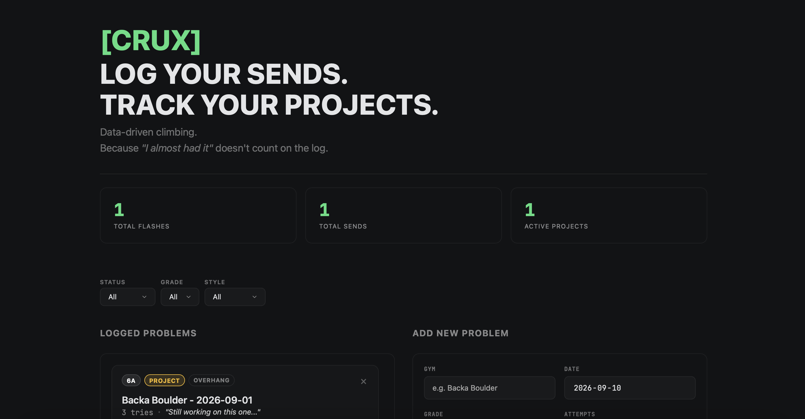

# CRUX — Bouldering Problem Tracker

CRUX is a minimalist, dark-themed Vue.js web application designed to log, filter, and keep track of bouldering climbs, active projects, and session stats. Built with a **mobile-first approach** for quick and seamless logging right at the gym.

🔗 **Live Demo:** [eeebbaandersson.github.io/crux/](https://eeebbaandersson.github.io/crux/)

⚠️ **Note –** This project is currently a **Work in Progress / Demo Version**. Data is saved client-side using `localStorage` or session memory.

---

## ✨ Features

* **Log & Edit Climbs:** Add new climbs or update existing ones with gym name, date, grade, attempts count, style, status, and optional notes.
* **Auto-Calculated Flashes:** Logs with 1 attempt and `Send` status automatically get tagged and tracked as a **Flash**.
* **Filter System:** Instantly filter logged problems by **Status** (*Flash, Send, Project, Reset*), **Grade**, or **Style** (*Dyno, Overhang, Roof, Slab, Vertical*).
* **Live Stats Counter:** Hero dashboard displaying total Flashes, total Sends, and active Projects.
* **User Profile & Settings:** Manage username, favorite climbing style, and view total "Unfinished Business" (reset routes).
* **Flexible Storage Options:** Toggle between browser `localStorage` (persistent data) or session memory mode.
* **Responsive Layout:** Designed for desktop and mobile, with specific Safari/iOS optimizations.

## 🛠️ Tech Stack

* **Vue.js 3** - (via CDN) 
* **HTML5 & CSS3**
* **LocalStorage** — Client-side data persistence
* **GitHub Pages** — Project hosting and deployment

## 🚀 Upcoming Features

* **Full-stack Migration:** Implement a RESTful API with **Node.js (Express)** and store user data using **PostgreSQL**.
* **Climbing Session Management:** Start a new session and group every climb during that time to a specific date and gym.
* **Advanced Analytics:** Dynamic progress charts over time (grade progression and style breakdown graphs).